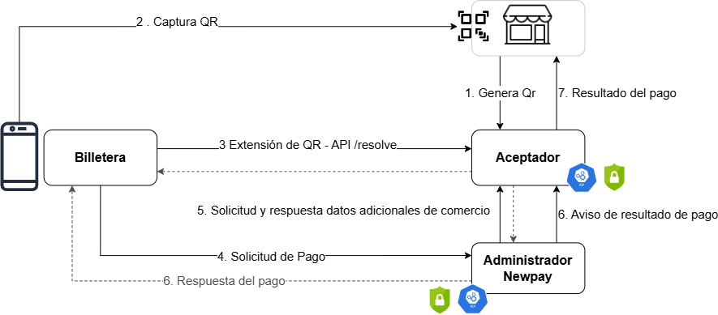

# Aceptadores

## Flujo de Pago QR

## 1) Archivo: *Documentación para Aceptadores*:
El presente documento tiene como finalidad explicar a alto nivel cómo funciona la operatoria de pagos QR con Transferencias Inmediatas. Se explicarán las interacciones con los distintos actores del sistema y la descripción de las distintas APIs a invocar en cada punto del proceso.

## 2) Archivo: *Autenticación entre Aceptadores y Administradores*:
El presente documento tiene como finalidad explicar cómo debe implementarse la autenticación en los distintos servicios entre el Aceptador y el Administrador.

## 3) Archivo: *Anexo Aceptador.rar*:
En este anexo se encuentra los swaggers de las APIs en formato ".yaml"

## 4) Archivo: *DI - Reporte de Liquidación para Aceptadores*:
El presente documento tiene como objetivo describir el diseño del reporte que se generará desde el rol Administrador para los Aceptadores que operen con esta solución.

## 5) Archivo: *Documentación APIs Proceso de Liquidación - Aceptador*:
El presente documento tiene como objetivo describir el set de APIs disponible para los Aceptadores que les permitirá consultar información relativa a la liquidación de tasa de intercambio.
